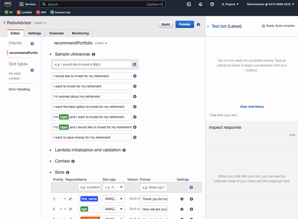

# Fin-Tech-Module-15

This module allow the exploration of AWS

### Lex Visual

### Lambda Visual

---

## Technologies

Python, Path, Pandas, sklearn.metrics, warnings

---

## Installation Guide

Create a dev environment. Run module via Jupyter Lab.

---
